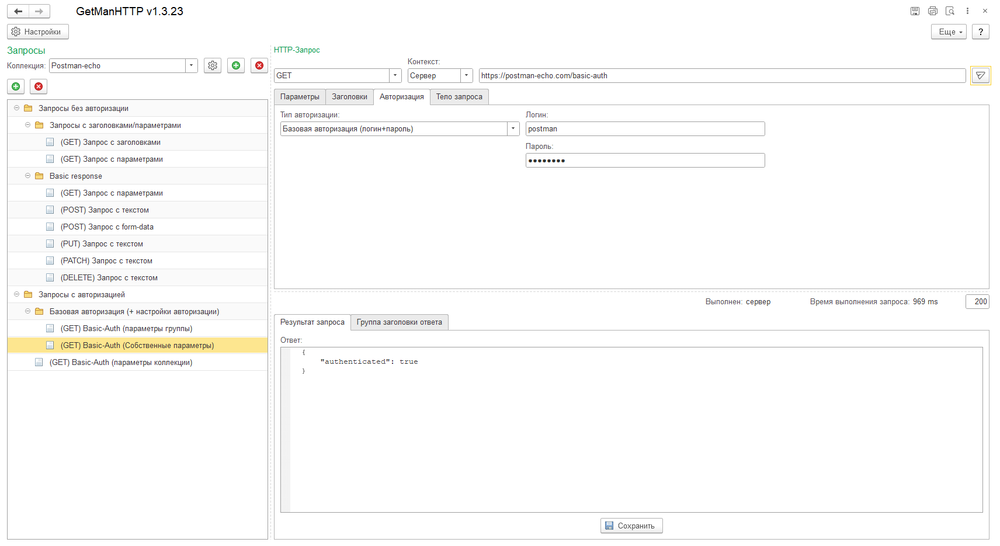
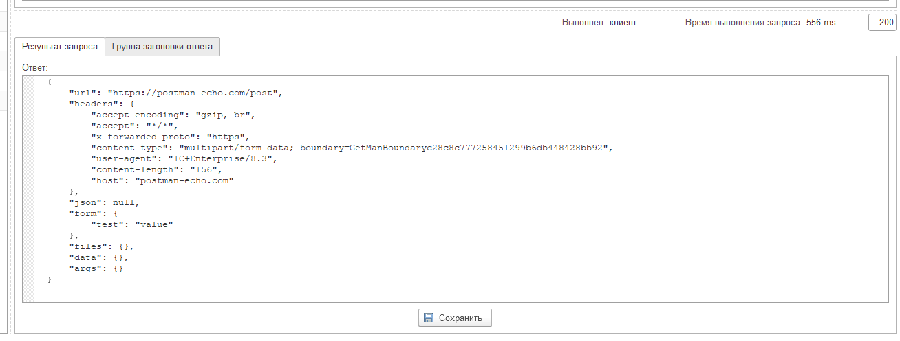
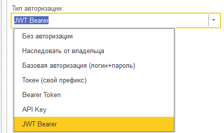
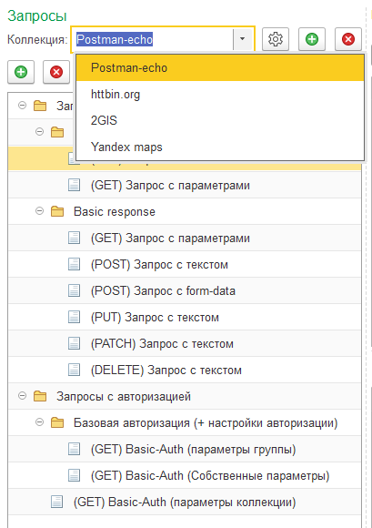
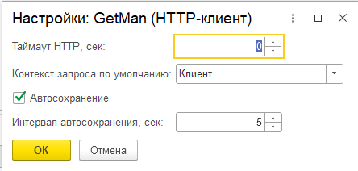
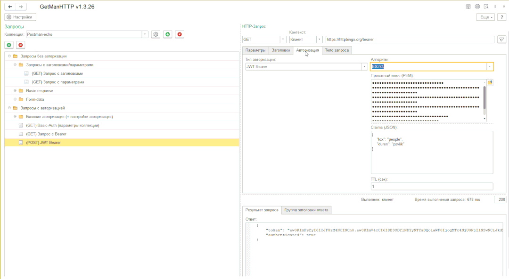

# HTTP-client for 1C:Enterprise

[](https://github.com/LunatikDG/GetManHTTP/blob/main/LICENSE.txt)
[](#)
[](https://github.com/LunatikDG/GetManHTTP/releases)
[](https://github.com/LunatikDG/GetManHTTP/actions/workflows/bsl-lint.yml)

<p align="center">
  <a href="#english">🇬🇧 English</a> •
  <a href="#русский">🇷🇺 Русский</a>
</p>

<p align="center">
  <a href="https://infostart.ru/1c/tools/2754850/">
    
  </a><br>
  <a href="https://infostart.ru/1c/tools/2754850/">Publication on Infostart</a>
  ·
  <a href="https://infostart.ru/1c/tools/2754850/">Публикация на Инфостарте</a>
</p>

---

<a name="english"></a>
## 🇬🇧 English

### Description

GetManHTTP is an HTTP client **external data processor** for **1C:Enterprise** —
something like Postman or Insomnia, but running inside 1C itself. Build a
request, send it, inspect the response, save it for later — without leaving
the platform.

What sets it apart from "just calling `HTTPСоединение` in code":

- Requests are organized in a **folder tree with collections**, not a single
  throwaway form — build up a library of requests and keep it between 1C
  sessions. Share a collection via **import/export** (native JSON or Postman
  Collection v2.1) from the collection settings dialog. Native format:
  [GetManHTTP Collection schema](docs/collection-format.md#english).
- Each request can run either from the **client** machine or from the
  **application server** — a distinction that matters a lot in 1C and has no
  equivalent in a browser-based REST client. See
  [HTTP execution context](#http-execution-context) below.
- It's a single `.epf` file — no configuration changes, no extension,
  drag it into any infobase via *File → Open*.

### Screenshots

**Main request form** — method, URL, headers/params/body/auth tabs, and the
request tree on the left.



**Response panel** — status code, execution time, "Executed: client/server"
indicator, response headers and formatted body.



**Authorization** — type selector (Basic / Token / API Key) with fields that adapt to
the chosen type.



**Request tree & collections** — folders, right-click menu (add / rename /
delete), a collection selected with its own settings.



**Settings form** — HTTP timeout, auto-save interval, default execution
context.



**Demo GIF** (optional but recommended) — record ~15–20 seconds: open the
form, create a request, pick a method, send it, show the response arriving.



### HTTP execution context

Each saved request stores its own mode:

| Mode | Behavior |
|------|----------|
| **Client** | HTTP goes from the user’s machine (1C thick client session). |
| **Server** | HTTP runs on the 1C application server (cluster worker). |

In **server** mode the request uses the **server’s network** and OS account, not the user’s PC. It may reach internal URLs that are blocked from the client (see [SECURITY.md](.github/SECURITY.md)).

**File infobase:** client and server often share one process; both modes may behave similarly — this is expected, not a defect.

**BINARY body in server mode:** the file is uploaded to temporary storage on the server (`НачатьПомещениеФайлаНаСервер`) before the request is sent.

Older saved requests without a stored mode default to **Client** (unchanged behavior).

### Installation

1. Download the [latest release](https://github.com/LunatikDG/GetManHTTP/releases)
2. Load the external data processor into your 1C configuration via
   *File → Open*

### Releasing (maintainers)

1. Push sources to `main` (folder `bin/` is gitignored; `.epf` is not stored in the repo).
2. Before tagging, bump `ВерсияОбработки()` in `Forms/Форма/Module.bsl` (form title) and the version line in form help / README badge to match the tag (`v_1_3_21` → `1.3.21`), and move the `[Unreleased]` entries in [CHANGELOG.md](CHANGELOG.md) under the new version **in both English and Russian** sections. Add anchors `changelog-X-Y-Z-en` / `changelog-X-Y-Z-ru` for the release notes links.
3. Create and push a tag: `git tag -a v_X_Y_Z -m "GetManHTTP vX.Y.Z"` then `git push origin v_X_Y_Z`
4. Workflow **Release** runs on a **self-hosted** Windows runner (`runs-on: [self-hosted, Windows, onec-build]`), builds `bin/GetManHTTP.epf` with local 1C:EDT + platform + license server, and attaches it to the GitHub release.

**Self-hosted runner (required for `.epf` builds)**

GitHub-hosted runners cannot use a device-bound 1C license. Register a runner on the build PC (repo or org): [Adding self-hosted runners](https://docs.github.com/en/actions/hosting-your-own-runners/managing-self-hosted-runners/adding-self-hosted-runners). Use labels **`self-hosted`**, **`Windows`**, **`onec-build`** (must match `.github/workflows/release.yml`). Install the runner as a Windows service so tag pushes build when you are not logged into a console session.

On that machine you need:

- 1C:Enterprise (Designer) and a working license / license server
- **1C:EDT 2025.1** with `1cedtcli` (EDT Lite under the interactive user profile is fine).
  EDT Lite is **not** a portable copy: `1cedt.ini` points at that user's
  `%USERPROFILE%\.p2` pool, so simply moving the install to `ProgramData` does not
  work for CI.
- The Release job runs as the runner Windows service (default
  `NT AUTHORITY\NETWORK SERVICE`). That account must be able to read/execute the
  EDT install **and** the `.p2` pool. On this maintainer host that means ACL grants
  on the user EDT tree and `.p2` (path traverse on parent folders as needed).
  Alternatively run the runner service as the same Windows user that owns the EDT
  install.
- Set host-specific tool paths on the **runner**, not in the committed workflow:
  create `C:\actions-runner\.env` (loaded when the runner service starts) with
  `ONEC_EDT_CLI`, `ONEC_V8_EXE`, and optionally `ONEC_EDT_VERSION`,
  `ONEC_V8_VERSION`, `ONEC_EDT_DATA`. `scripts\build-epf.ps1` also auto-detects
  common install locations when these are unset. Restart the runner service after
  changing `.env`.
- The workflow uses `cmd` + `powershell -ExecutionPolicy Bypass` so a machine-wide
  `Set-ExecutionPolicy` is optional (only needed if you switch steps to
  `shell: powershell`).

No `ONEC_USERNAME` / `ONEC_PASSWORD` / `ONEC_LICENCE` secrets are required for Release when tools and licenses are already on the runner host. `GITHUB_TOKEN` is provided automatically for creating the release.

Local smoke-test (same host as the runner):

```powershell
cd GetManHTTP
.\scripts\build-epf.ps1
# or: .\scripts\build-epf.ps1 -OutputEpf "bin\GetManHTTP.epf"
```

Or `scripts\build-epf.cmd`. Prefer **1C:EDT 2025.1** and platform **8.3.27** (from `DT-INF/PROJECT.PMF`). If only EDT 2024.x is installed, the script warns and may fail on export — install EDT 2025.1 or set `ONEC_EDT_CLI` to its `1cedtcli.exe`.

Close **1C:EDT** before building. The script auto-detects the workspace in the parent folder (`GetManHTTP` with `.metadata`) when present. First CLI export in a fresh workspace can take **10–30+ minutes**.

Optional: `ONEC_EDT_DATA`, `ONEC_EDT_VERSION`, `ONEC_EDT_CLI`, `ONEC_V8_EXE`, `ONEC_V8_VERSION`. For the `.epf` step the script defaults to **8.3.27** from `DT-INF/PROJECT.PMF`, not the newest installed platform (e.g. 8.5.x).
Pushes and pull requests to `main` that touch `src/` run **BSL Language Server** static analysis (see `.github/workflows/bsl-lint.yml` and `.bsl-language-server.json`).

Before push (JDK **21** required locally):

```powershell
.\scripts\bsl-lint.ps1
```

Or: `scripts\bsl-lint.cmd`, or `./scripts/bsl-lint.sh` (Git Bash/WSL). JAR and reports go to `.ci/` and `reports/` (gitignored).

### Requirements

- 1C:Enterprise 8.3.26 (not tested on earlier versions) or higher
- Internet access
- Permission to use external data processors

### Contributing

Bug fixes and features are welcome — see [CONTRIBUTING.md](CONTRIBUTING.md)
for the project layout, build/lint prerequisites, and PR process. Bugs and
ideas: [issue templates](.github/ISSUE_TEMPLATE/).

### Changelog

Release history lives in bilingual [CHANGELOG.md](CHANGELOG.md)
([English](CHANGELOG.md#english) / [Русский](CHANGELOG.md#русский)).

### Contact

Feedback, suggestions and bug reports are welcome:

- Email: <main@lunatikdg.ru>
- Telegram: [@LunatikDG](https://t.me/LunatikDG)
- Infostart: [article](https://infostart.ru/1c/tools/2754850/)

---

<a name="русский"></a>
## 🇷🇺 Русский

### Описание

GetManHTTP — это HTTP-клиент, оформленный как **внешняя обработка** для
**1С:Предприятие** — что-то вроде Postman или Insomnia, но работающее прямо
внутри 1С. Собрать запрос, отправить, посмотреть ответ, сохранить на
будущее — не выходя из платформы.

Чем это отличается от «просто вызвать `HTTPСоединение` в коде»:

- Запросы организованы в **дерево папок с коллекциями**, а не в одноразовую
  форму — можно накапливать библиотеку запросов, она сохраняется между
  сеансами 1С. Коллекцию можно **импортировать и экспортировать** (свой JSON
  или Postman Collection v2.1) из формы настроек коллекции. Нативный формат:
  [схема GetManHTTP Collection](docs/collection-format.md#русский).
- Каждый запрос может выполняться либо с **клиента**, либо на **сервере
  приложений** — различие, которое в 1С имеет реальное значение и которого
  нет у браузерных REST-клиентов. Подробнее — раздел [Контекст выполнения
  HTTP](#контекст-выполнения-http) ниже.
- Это один файл `.epf` — не нужно менять конфигурацию или ставить
  расширение, просто перетащите его в любую базу через *Файл → Открыть*.

### Скриншоты

**Главная форма запроса** — метод, URL, вкладки заголовков/параметров/тела/
авторизации и дерево запросов слева.


**Панель ответа** — код состояния, время выполнения, индикатор «Выполнен:
клиент/сервер», заголовки ответа и форматированное тело.


**Авторизация** — выбор типа (Basic / Token / API Key) с полями, которые меняются в
зависимости от выбранного типа.


**Дерево запросов и коллекции** — папки, контекстное меню (добавить /
переименовать / удалить), выбранная коллекция с собственными настройками.


**Форма настроек** — таймаут HTTP, интервал автосохранения, контекст
выполнения по умолчанию.


**GIF-демонстрация** (не обязательно, но желательно) — запишите 15–20
секунд: открыли форму, создали запрос, выбрали метод, отправили, показали
пришедший ответ.


### Контекст выполнения HTTP

Режим хранится отдельно для каждого запроса в списке:

| Режим | Поведение |
|-------|-----------|
| **Клиент** | Запрос уходит с рабочей станции пользователя (сеанс толстого клиента). |
| **Сервер** | Запрос выполняется на сервере 1С (рабочий процесс кластера). |

В режиме **Сервер** используется **сеть и учётная запись сервера**, а не ПК пользователя. Возможен доступ к внутренним URL, недоступным с клиента (см. [SECURITY.md](.github/SECURITY.md)).

**Файловая база:** клиент и сервер часто работают в одном процессе — оба режима могут вести себя одинаково; это нормально, а не ошибка.

**Двоичное тело (BINARY) в режиме «Сервер»:** файл сначала передаётся на сервер во временное хранилище (`НачатьПомещениеФайлаНаСервер`), затем отправляется в запросе.

У старых сохранённых запросов без поля режима подставляется **Клиент** (поведение как раньше).

### Установка

1. Скачайте [последний релиз](https://github.com/LunatikDG/GetManHTTP/releases)
2. Загрузите обработку в конфигурацию 1С через *Файл → Открыть*

### Релиз (для мейнтейнеров)

1. Исходники в `main` (каталог `bin/` в git не хранится; `.epf` только в релизах).
2. Перед тегом обновите `ВерсияОбработки()` в `Forms/Форма/Module.bsl` (заголовок формы) и строку версии в справке формы / бейдже README под тег (`v_1_3_21` → `1.3.21`), а также перенесите записи из `[Unreleased]` в [CHANGELOG.md](CHANGELOG.md) под новую версию **в английском и русском** разделах. Добавьте якоря `changelog-X-Y-Z-en` / `changelog-X-Y-Z-ru` для ссылок в описании релиза.
3. Создайте и запушьте тег: `git tag -a v_X_Y_Z -m "GetManHTTP vX.Y.Z"` затем `git push origin v_X_Y_Z`
4. Workflow **Release** выполняется на **self-hosted** Windows-runner (`runs-on: [self-hosted, Windows, onec-build]`), собирает `bin/GetManHTTP.epf` локальными EDT + платформой + сервером лицензий и прикладывает файл к GitHub Release.

**Self-hosted runner (нужен для сборки `.epf`)**

На GitHub-hosted runner программная лицензия 1С с вашего ПК не работает. Зарегистрируйте runner на сборочном ПК (репозиторий или организация): [Adding self-hosted runners](https://docs.github.com/en/actions/hosting-your-own-runners/managing-self-hosted-runners/adding-self-hosted-runners). Labels: **`self-hosted`**, **`Windows`**, **`onec-build`** (как в `.github/workflows/release.yml`). Установите runner как службу Windows, чтобы сборка по тегу шла без интерактивной сессии.

На этой машине должны быть:

- 1С:Предприятие (Конфигуратор) и рабочая лицензия / сервер лицензий
- **1C:EDT 2025.1** с `1cedtcli` (EDT Lite в профиле интерактивного пользователя —
  нормальный вариант). Lite **не портативен**: в `1cedt.ini` прописан пул
  `%USERPROFILE%\.p2` этого пользователя, поэтому простое копирование в
  `ProgramData` для CI не подходит.
- Job Release выполняется от службы runner (по умолчанию
  `NT AUTHORITY\NETWORK SERVICE`). У этой учётки должны быть права на чтение/запуск
  установки EDT **и** пула `.p2`. На сборочном хосте мейнтейнера это сделано ACL
  на дерево EDT в профиле и на `.p2` (плюс обход родительских каталогов). Альтернатива —
  запускать службу runner от того же Windows-пользователя, у которого стоит EDT.
- Пути к инструментам задавайте на **runner**, а не в закоммиченном workflow:
  файл `C:\actions-runner\.env` (подхватывается при старте службы) с
  `ONEC_EDT_CLI`, `ONEC_V8_EXE` и при необходимости `ONEC_EDT_VERSION`,
  `ONEC_V8_VERSION`, `ONEC_EDT_DATA`. `scripts\build-epf.ps1` также ищет типовые
  каталоги установки, если переменные не заданы. После правки `.env` перезапустите
  службу runner.
- Workflow использует `cmd` + `powershell -ExecutionPolicy Bypass`, поэтому
  машинный `Set-ExecutionPolicy` не обязателен (нужен только если переведёте шаги
  на `shell: powershell`).

Секреты `ONEC_USERNAME` / `ONEC_PASSWORD` / `ONEC_LICENCE` для Release **не нужны**, если инструменты и лицензии уже на хосте runner. `GITHUB_TOKEN` выдаётся автоматически для публикации релиза.

Проверка на том же ПК:

```powershell
cd GetManHTTP
.\scripts\build-epf.ps1
# or: .\scripts\build-epf.ps1 -OutputEpf "bin\GetManHTTP.epf"
```

Или `scripts\build-epf.cmd`. Ориентир — **1C:EDT 2025.1** и платформа **8.3.27** (из `DT-INF/PROJECT.PMF`). Если установлен только EDT 2024.x, будет предупреждение и export может падать — поставьте EDT 2025.1 или укажите `ONEC_EDT_CLI`.

Перед сборкой **закройте 1C:EDT**. Скрипт сам находит рабочую область в родительской папке (`GetManHTTP` с `.metadata`), если она есть. В чистом workspace первый export может занять **10–30+ минут**.

Опционально: `ONEC_EDT_DATA`, `ONEC_EDT_VERSION`, `ONEC_EDT_CLI`, `ONEC_V8_EXE`, `ONEC_V8_VERSION`. Для сборки `.epf` скрипт по умолчанию берёт платформу **8.3.27** из `DT-INF/PROJECT.PMF`, а не самую новую установленную (8.5.x).
При push и pull request в `main`, если меняется `src/`, запускается статический анализ **BSL Language Server** (см. `.github/workflows/bsl-lint.yml` и `.bsl-language-server.json`).

Перед push (локально нужна **Java 21**):

```powershell
.\scripts\bsl-lint.ps1
```

Также: `scripts\bsl-lint.cmd` или `./scripts/bsl-lint.sh` (Git Bash/WSL). JAR и отчёты попадают в `.ci/` и `reports/` (в git не коммитятся).

### Требования

- 1С:Предприятие 8.3.26 (на более ранних версиях не тестировалось) и выше
- Доступ в интернет
- Разрешение на использование внешних обработок

### Контрибьютинг

Багфиксы и новые фичи приветствуются — структура проекта, требования к
окружению для сборки/линта и порядок PR описаны в
[CONTRIBUTING.md](CONTRIBUTING.md). Баги и идеи — через
[шаблоны issue](.github/ISSUE_TEMPLATE/).

### История изменений

Список релизов — в двуязычном [CHANGELOG.md](CHANGELOG.md)
([English](CHANGELOG.md#english) / [Русский](CHANGELOG.md#русский)).

### Связь

Замечания, пожелания и обратную связь можно отправить по следующим
контактам:

- Почта: <main@lunatikdg.ru>
- Telegram: [@LunatikDG](https://t.me/LunatikDG)
- Инфостарт: [публикация](https://infostart.ru/1c/tools/2754850/)
